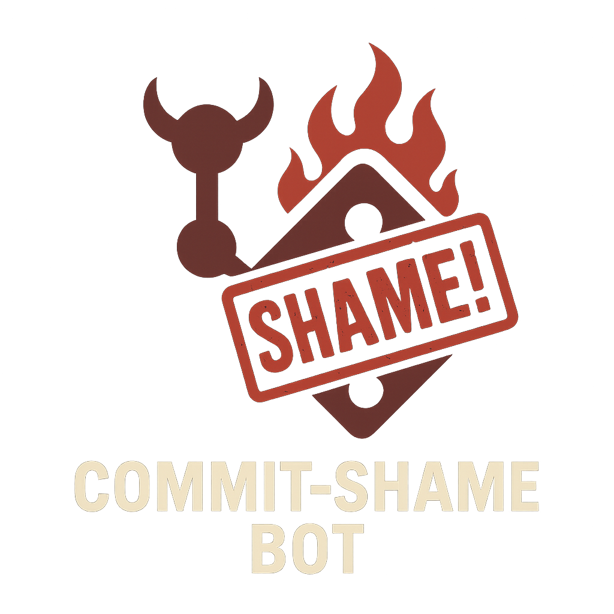

[☕ Buy me a coffee!](https://buymeacoffee.com/jinparkmida) — Totally optional, this project is free, but if you want to fuel more shaming bots, you know what to do!



[](https://github.com/yourusername/CommitShame/actions/workflows/test.yml)

# Commit-Shame Bot™️

> _"Finally, a bot that tells me what my coworkers are too polite to say."_
> — Satisfied Developer

## 🚀 The Ultimate Git Productivity Solution (That Roasts You)

Are your commit messages a crime against humanity? Do your diffs look like you sneezed on your keyboard? **Commit-Shame Bot™️** is here to help! This brutally honest, yet lovingly crafted, Git hook suite will:

- **Shame you for tiny or monstrous diffs** (pre-commit)
- **Roast your lazy commit messages** (commit-msg)
- **Block dangerous pushes** (pre-push)
- **Track the Hall of Shame** (leaderboard)
- **Deliver rare praise for greatness**
- **Drop random Git tips and best practices**
- **Support themed insult packs and language-specific roasts**
- **Send public shames to Slack/Discord (optional)**
- **Hide rare ASCII art easter eggs**
- **Let you pick your level of shame: Gentle, Sarcastic, Savage**

All with the polish of a Fortune 500 SaaS product, but the price of a dad joke (free).

---

## Why Commit-Shame Bot™️?
- **Professional polish, unprofessional burns**
- **Cross-platform**: Windows, macOS, Linux
- **Zero dependencies** (unless you count self-esteem)
- **Easy install**: One command, instant shame
- **Customizable**: Add your own insults, rules, and config

> _"My code quality improved 9000%. My ego? Not so much."_
> — Anonymous Intern

---

## Installation

### Windows (PowerShell)
```powershell
./install-commit-shame.ps1
```

### macOS/Linux (Bash)
```bash
./install-commit-shame.sh
```

---

## Configuration
Create a `.commit-shame-config` file in your repo root to customize the bot:

```bash
# .commit-shame-config example
MIN_LINES=3
MAX_LINES=200
MIN_LENGTH=10
FORBIDDEN_WORDS="fix stuff wip temp"
INSULT_PACK=pirate   # Options: dad, pirate, shakespeare, corporate
SHAME_LEVEL=savage   # Options: gentle, sarcastic, savage
LINT_CONVENTIONAL=true
WEBHOOK_URL="https://hooks.slack.com/services/your/webhook/url"
CUSTOM_INSULTS="This is a custom roast!|Another custom burn!"
```

### Advanced Configuration (.shamerc)
For more advanced configuration, copy `.shamerc.example` to `.shamerc` in your repo root:

```yaml
# .shamerc example
min_lines: 3
max_lines: 200
insult_pack: pirate
shame_level: savage
lint_conventional: false
webhook_url: ""
plugins:
  - name: "no-todo"
    enabled: true
```

---

## Features
- **pre-commit hook:** Shames you if your staged diff is too small/large, with language-specific and themed insults, rare ASCII art, and random Git tips.
- **commit-msg hook:** Roasts bad commit messages, enforces forbidden words, optional conventional commit linting, and rare praise for greatness.
- **pre-push hook:** Blocks pushes to main/master or >10 commits at once, with leaderboard and tips.
- **Leaderboard:** Tracks top offenders in `.git/commit-shame-stats` and prints the Hall of Shame.
- **Insult Packs:** Choose your flavor: Dad, Pirate, Shakespearean, Corporate, or add your own.
- **Shame Level:** Gentle (friendly), Sarcastic (default), Savage (brutal).
- **Language Detection:** Tailors insults to your repo's main language (Python, JS, Java, C, C++, Go, Ruby).
- **Public Shame:** Set `WEBHOOK_URL` to post shames to Slack/Discord.
- **Easter Eggs:** 1% chance of rare ASCII art or extra-funny lines.
- **Praise:** Rare, personalized compliments for great commits.
- **Random Tips:** Git best practices and pro tips, sprinkled in.
- **Plugin System:** Extend functionality with custom rules in `hooks.d/`.
- **CI/CD Ready:** Automated testing with GitHub Actions.

---

## Plugin System
Create custom rules by adding scripts to `hooks.d/`:

```bash
# Example plugin: hooks.d/no-todo.sh
#!/usr/bin/env bash
# Shames users for committing TODO comments
if git diff --cached | grep -qi "TODO"; then
  echo "🛑 No TODO comments allowed!"
  exit 1
fi
```

Enable plugins in your `.shamerc`:
```yaml
plugins:
  - name: "no-todo"
    enabled: true
```

---

## Usage
- Commit and push as usual. If you break the rules, the bot will block your action and deliver a world-class roast (or, rarely, a compliment).
- To customize the shame, edit `.commit-shame-config`, `pre-commit.sh`, or `commit-msg.sh`.

---

## Uninstall
Simply delete `.git/hooks/pre-commit`, `.git/hooks/commit-msg`, and `.git/hooks/pre-push`. Your feelings may take longer to recover.

---

## Support
Having trouble? Try reading the error message. Still stuck? Ask your nearest millennial. If all else fails, open an issue and we’ll shame you in public.

---

## Testimonials
> _"I used to write 'fix stuff' for every commit. Now I write novels."_  
> — Former Serial Offender

> _"Commit-Shame Bot made me a better developer. Or at least a more creative liar."_  
> — Senior Engineer

> _"10/10, would be roasted again."_  
> — Happy Customer

---

**Commit-Shame Bot™️** — Because your code isn’t the only thing that needs a review. 

## Troubleshooting

### Line Ending Issues

If you encounter "Permission denied" or "bad interpreter" errors when running the installer or hooks, it's likely due to Windows line endings (CRLF) in the shell scripts.

**Quick Fix (Windows):**
```powershell
# Run the included PowerShell script
.\fix-line-endings.ps1
```

**Manual Fix (Any OS):**
```bash
# Convert all .sh files to Unix line endings
find . -type f -name "*.sh" -exec sed -i 's/\r$//' {} +
```

**Prevention:**
The `.gitattributes` file ensures all `.sh` files are normalized to LF line endings in Git. After fixing line endings once, future clones will have the correct format. 
